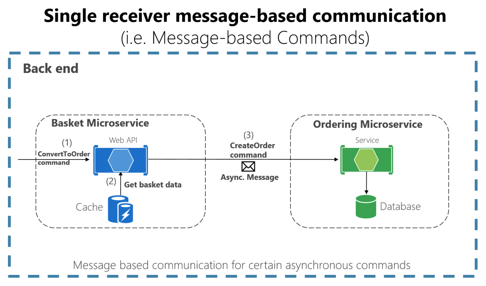
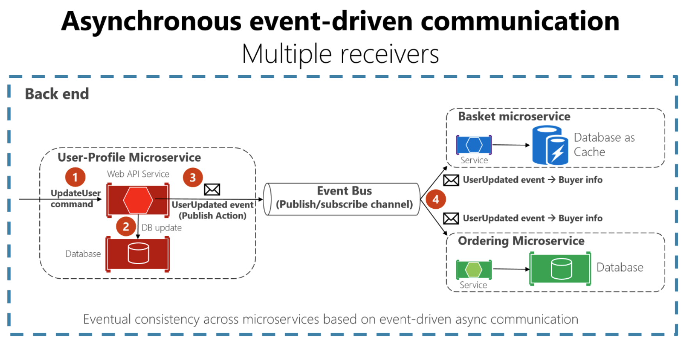

# Communication

The microservice community promotes the philosophy of "smart endpoints and dumb pipes" This slogan encourages a design that's as decoupled as possible between microservices, and as cohesive as possible within a single microservice.

The two commonly used protocols are

- HTTP request/response with resource APIs (when querying most of all)

- lightweight asynchronous messaging when communicating updates across multiple microservices.

## Communication styles

There are many protocols and choices you can use for communication, depending on the communication type you want to use.

If you're using a **synchronous request/response-based** communication mechanism, protocols such as **HTTP and REST approaches** are the most common, especially if you're publishing your services outside the Docker host or microservice cluster.

If you're communicating **between services internally** (within your Docker host or microservices cluster), you might also want to use **binary format communication mechanisms** (like WCF using TCP and binary format). Alternatively, you can use asynchronous, message-based communication mechanisms such as AMQP.

## Communication types

The first axis defines if the protocol is **synchronous or asynchronous**:

Synchronous protocol. HTTP is a synchronous protocol. The client sends a request and waits for a response from the service.

Asynchronous protocol. The client code or message sender usually doesn't wait for a response. It just sends the message as when sending a message to a RabbitMQ queue or any other message broker.

The second axis defines if the communication has a **single receiver or multiple receivers**:

Single receiver. Each request must be processed by exactly one receiver or service. An example of this communication is the [Command pattern](https://en.wikipedia.org/wiki/Command_pattern).

Multiple receivers. Each request can be processed by zero to multiple receivers. This type of communication must be asynchronous. An example is the [publish/subscribe](https://en.wikipedia.org/wiki/Publish%E2%80%93subscribe_pattern) mechanism used in patterns like [Event-driven architecture](https://microservices.io/patterns/data/event-driven-architecture.html). This is based on an event-bus interface or message broker when propagating data updates between multiple microservices through events.

## Asynchronous message-based communication

There are 2 rules:

- use **lightweight message broker**. most of the "smart" thinking still lives in the endpoints that are producing and consuming messages-that is, in the microservices.

- use only asynchronous messaging between the internal services, and to use synchronous communication (such as HTTP) only from the client apps to the front-end services

There are two kinds of asynchronous messaging communication:

- single receiver message-based communication

- multiple receivers message-based communication

### Single receiver message-based communication

Attention: **Due to network or other failures**, the client has to be able to **retry sending messages**, and the server has to implement an operation to be **idempotent** in order to process a particular message just once.

### Multiple receivers message-based communication

The goal is to have **eventual consistency** between multiple data sources across your distributed system.

When you use an event bus, you might want to use an **abstraction level** (like an event bus interface) based on a related implementation in classes with code using the API from a **message broker** like [RabbitMQ](https://www.rabbitmq.com/) or a **service bus** like Azure Service Bus with Topics. Alternatively, you might want to use a **higher-level service bus** like [NServiceBus](https://particular.net/nservicebus), [MassTransit](https://masstransit-project.com/), or [Brighter](https://github.com/BrighterCommand/Brighter) to articulate your event bus and publish/subscribe system.

A challenge when implementing an event-driven architecture across multiple microservices is how to atomically update state in the original microservice while **resiliently publishing** its related integration event into the event bus, somehow based on **transactions**.

## API Versioning

If you're using an HTTP-based mechanism such as REST, one approach is to embed the API version number in the URL or into an HTTP header. A good approach for this functionality is the [Mediator pattern](https://en.wikipedia.org/wiki/Mediator_pattern) (for example, [MediatR library](https://github.com/jbogard/MediatR)) to decouple the different implementation versions into independent handlers.

Finally, if you're using a REST architecture, Hypermedia is the best solution for versioning your services and allowing evolvable APIs.

## Microservices addressability and the service registry

Each microservice has a unique name (URL) that's used to resolve its location. There needs to be a **service registry**.

The registry is a database containing the network locations of service instances. A service registry needs to be **highly available** and **up-to-date**. Clients could cache network locations obtained from the service registry.
