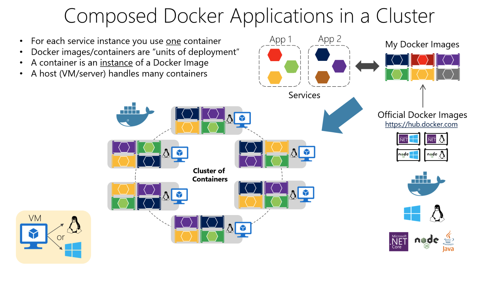

# Orchestrating

## Resiliency and high availability

There needs to be resiliency in the **compute capability** (the process can restart at any time) as well as resilience in **the state or data** (no data loss, and the data remains consistent).

The problems of resiliency are compounded during other scenarios, such as when failures occur during an application upgrade. The microservice emits **health information** so that the overall application and orchestrator can make these decisions.

### Health checks

There aee 2 library can be used:

- ASP.NET HealthChecks Library
- AspNetCore.Diagnostics.HealthChecks

It handles two types of checks:

- Liveness: Checks if the microservice is alive, that is, if it's able to accept requests and respond.

- Readiness: Checks if the microservice's dependencies (Database, queue services, etc.) are themselves ready, so the microservice can do what it's supposed to do.

### Using diagnostics and logs event streams

In **monolithic server-based** applications, you can write logs to a file on **disk (a logfile)** and then analyze it with any tool.

A microservice-based application should not try to store the output stream of events or logfiles by itself, and not even try to manage the routing of the events to a central place.

There are 2 approaches:

- Event stream router, Microsoft.Diagnostic.EventFlow, which collects event streams from multiple sources and publishes it to output systems.

- Third-party log analysis platforms and tools that can search, alert, report, and monitor logs, even in real time, like [Splunk](https://www.splunk.com/).

## Orchestrate microservices

