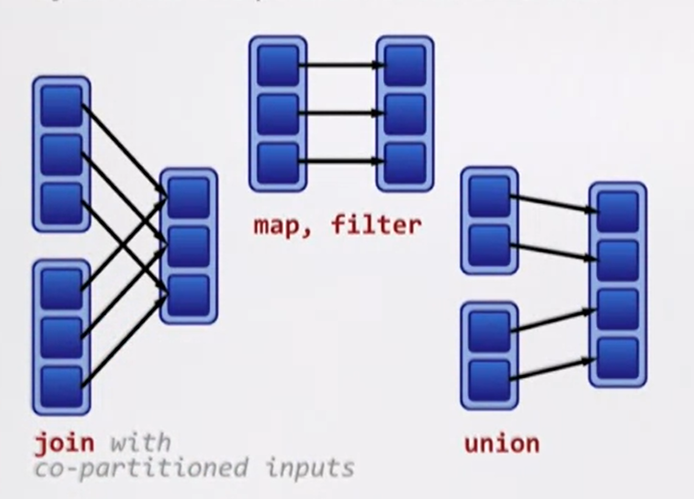
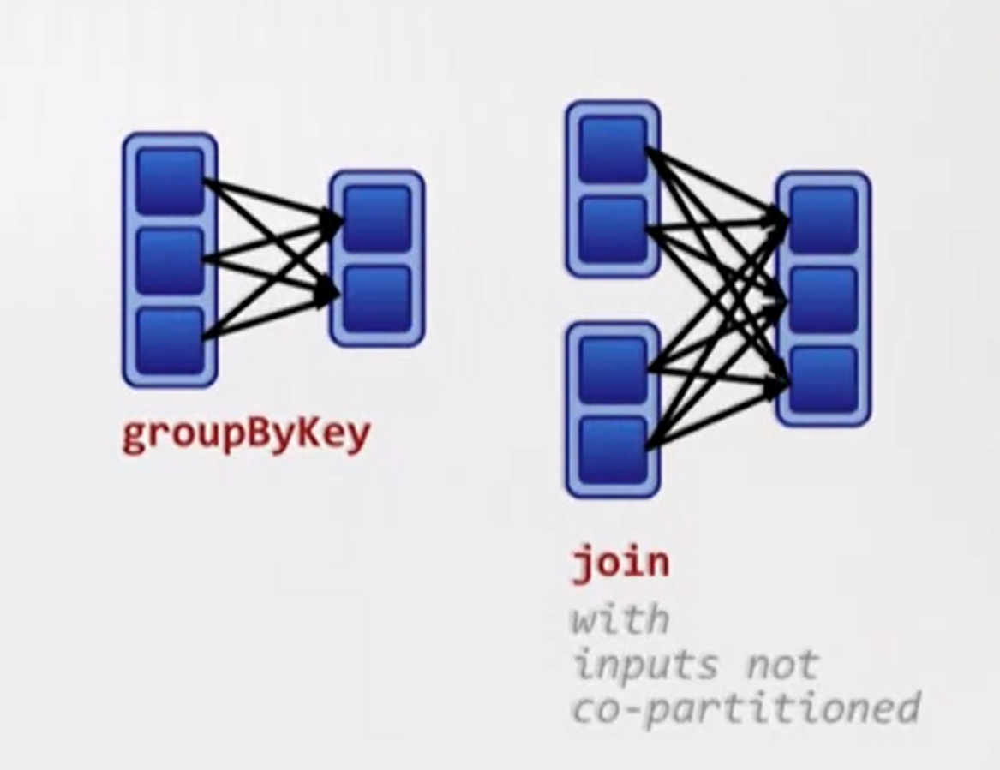

# Dependencies

The rule of thumb tries to determine when a shuffle might occur.

**Rule of thumb**: A shuffle can occur when the resulting RDD **depends on other elements** from the same RDD or another RDD.

Transformations can have two kinds of dependencies:

- Narrow dependencies

  Each partition of the parent RDD is used by **at most one** partition of the child RDD.

  It's **fast**. No shuffle necessary.

- Wide dependencies

  Each partition of the parent RDD is used by **multiple** partitions of the child RDD.

  It's **slow**. Requires all or some data to be shuffled over the network.

## Narrrow dependencies

- `map`

- `union`

- `join`

## Wide dependencies

- `groupBy`

- `join`

## How can I find out the type of dependencies ?

`dependencies` or `toDebugString` method on RDDs.

- Narrow dependency objects

  - OneToOneDependency (commonly seen)
  - PruneDependency
  - RangeDependency

- Wide dependency objects

  - ShuffleDependency

## Fault tolerance

**Lineages graph** is the key to the fault tolerance in Spark.

> Tree is a lineage graph.

Ideas from **functional programming** enables fault tolerance in Spark:

- RDD is **immutable**.

- We use **higher-order functions**, such as `map`, on the immutable data.

- A **function** for computing based on its parent RDDs is also a part of RDD's representation.
