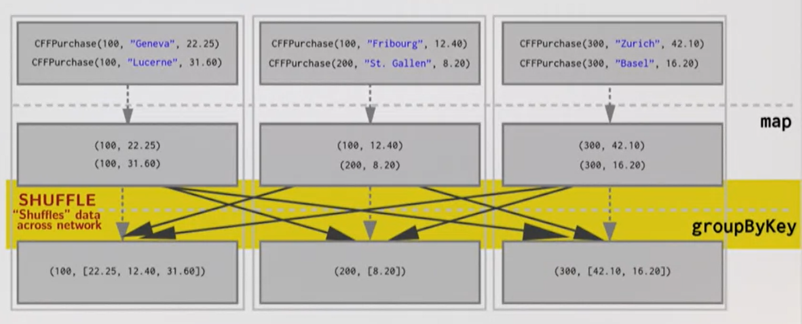

# Shuffling

**Moving data from one node to another** is called shuffling.

Shuffling causes the latency. Therefore, it's a huge hit on the performance.

Shuffling can be caused by, for example, `groupbyKey`.



As we can see, **sending data across the network** causes the latency. So, we need to send as less data as possible.

`reduceByKey` function is designed for that. This function will, first, **reduce on the same node**, then shuffle.

## Example

```scala
val cost = purchases
  .map(p => (p.id, p.price))
  .groupByKey()
  .map(p => (p._1, (p._2.size, p._2.sum)))
  .count()

// Command took 15.48s
```

```scala
val cost = purchases
  .map(p => (p.id, (1, p.price)))
  .reduceByKey((a, b) => (a._1 + b._1, a._2 + b._2))
  .count()

// Command took 4.65s
```

`reduceByKey` is almost 4 times faster.
