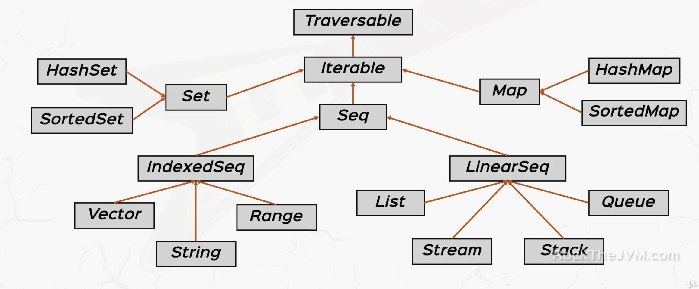

# Collections

Scala provides both mutable and immutable collections. Immutable collections never change. By default, we use **immutable collections**.

```scala
object Predef {
  type Map[A, +B] = immutable.Map[A, B]
}
```

## Immutable collections

Immutable collections are found in `scala.collections.immutable` package. Here is the tree.

