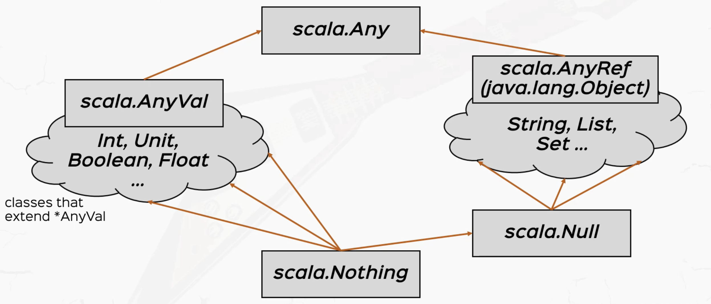

# Inheritance

Scala offers the **single class inheritance**, which means a class can only inherit **ONE** class.

## Constructor

JVM initializes the parent class before the current class.

```scala
class Person(name: String)
class Adult(name: String, job: String) extends Person(name)
```

## Override

```scala
class Animal {
  protected def eat = println("nom nom")
}
class Dog extends Animal {
  override def eat = println("crunch crunch")
}
```

`Dog` overrides the method `eat` from its parent class `Animal`.

We can also prevent override.

- add `final` to the **class member (attribute or method)** so that it can't be overrided by derived classes.

  ```scala
  class Animal {
    final def eat = println("nom nom")
  }
  ```

- add `final` to the **class itself** so that the class can't be inherited.

  ```scala
  final class Animal
  ```

- `sealed` the class so that it can ONLY be inherited by **the classes in the same file**.

  ```scala
  sealed class Animal
  ```

## Polymorphism

```scala
val pet: Animal = new Dog
```

In this case, `pet` is an instance of `Dog` although we declare it as an `Animal`.

## Abstract class

```scala
abstract class Animal {
  val type: String
  def eat: Unit
}
```

In this abstract class, both the attribute and the method are **not defined**. We can let sub-classes to implement them.

Of course, we can put **non abstract member** to an abstract class.

```scala
abstract class Animal {
  val type: String
  def eat = println("nom nom")
}
```

## Traits

Since Scala class can ONLY inherit ONE class, we create `trait` to make it extend **multiple traits**.

Therefore, `trait` is same to `abstract class`, which can have both **abstract** and **non abstract** member.

```scala
abstract class Animal
trait Flying
trait Eating

class Bird extends Animal with Flying with Eating
```

## Type Hierarchy



- `Any` is the root class.

- `AnyRef` and `AnyVal` inherit `Any`

  - `AnyRef` contains the classes from `Java.lang.Object`, such as `String`, `List`, `Set`, etc. `Null` inherit it.

  - `AnyVal` contains primitive classes, such as `Int`, `Boolean`, `Float`, `Unit`, etc.

- `Nothing` inherits all the classes in Scala.

```scala
var a: Int = ??? // It means Nothing.
```

## Anonymous class

```scala
class Person(val name: String) {
  def greet = println(s"I'm $name.")
}

val jack = new Person("Jack") {
  override def greet = println(s"My name is $name.")
}
```

In this case, Scala will create an **anonymous class** that inherits the class `Person` and instanize it.
